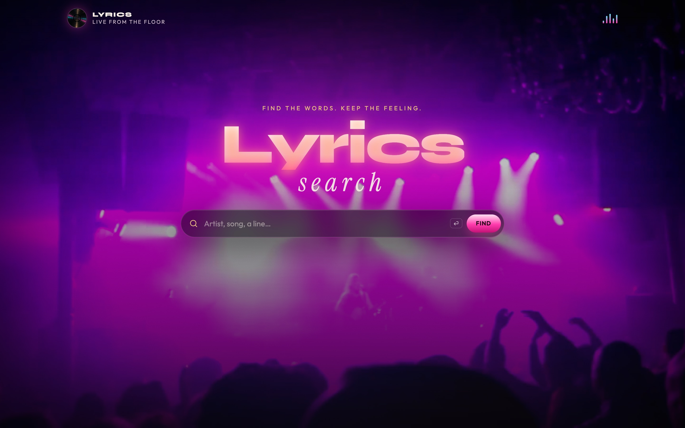
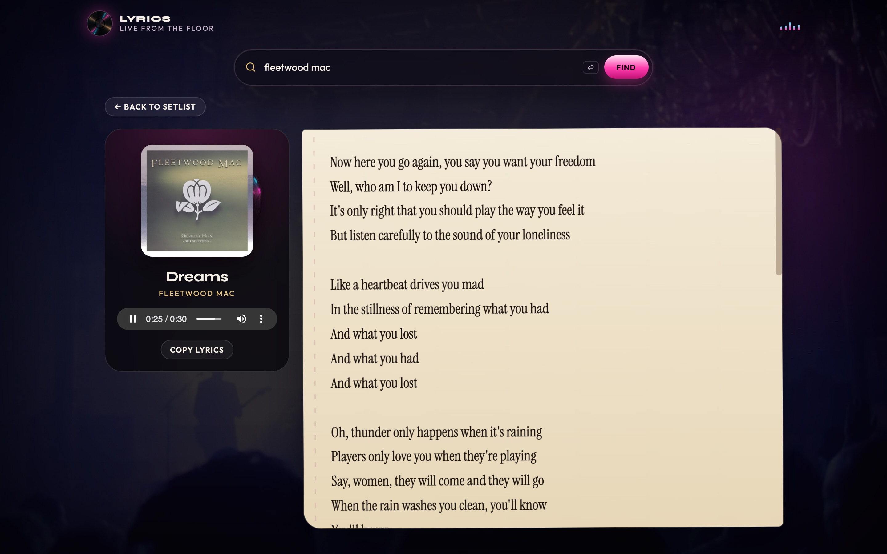

```

          .;                               .-.                                            
         .;'            .-.                `-'                                       .;   
        .;.    .-..;.::.`-' .-.      .     ;'    .      .  .-.  .-.     .;.::..-.    ;;-. 
       ::  `:  ;  .;   ;'  ;       .';    .;   .';    .';.;.-' ;   :    .;   ;      ;;  ; 
     _;;_.- `.' .;' _.;:._.`;;;;'.' .' :  :: .' .'  .' .' `:::'`:::'-'.;'    `;;;;'.;`  ` 
         -.;'                   '      `:::''      '                                      
```

# Lyrics Search

Find the words. Keep the feeling.

A late-night booth for the line you half remember: search a song or artist, play a preview, and pull the lyrics onto the page.

**Demo:** [tagaism.github.io/lyrics_search_js](https://tagaism.github.io/lyrics_search_js)



## On the floor

Search landed Fleetwood Mac — *The Chain*, *Silver Springs*, *Dreams*, *Landslide*, *Rhiannon*, *You Make Loving Fun*, *Gypsy*, *Gold Dust Woman*.


Open a cut and the words come up on a setlist sheet. Here’s *Dreams*, preview rolling:



## Run it locally

No build step. Serve the folder and open it in a browser:

```bash
python3 -m http.server 8000
```

Then visit [http://localhost:8000](http://localhost:8000).

## How it works

| Piece | Source |
| --- | --- |
| Catalog + 30s previews | [iTunes Search API](https://developer.apple.com/library/archive/documentation/AudioVideo/Conceptual/iTuneSearchAPI/index.html) |
| Lyrics | [lyrics.ovh](https://lyricsovh.docs.apiary.io/), then [LRCLIB](https://lrclib.net) if that misses |

Vanilla HTML, CSS, and ES6. Arrow functions and array methods throughout. Recent searches live in `localStorage`.

### Keyboard

| Key | Action |
| --- | --- |
| `Enter` | Search |
| `/` | Focus the search field |
| `Esc` | Back to the setlist from lyrics |

## Original brief

1. ES6 for functions and variables
2. Arrow-style functions
3. Higher-order functions for arrays and objects
